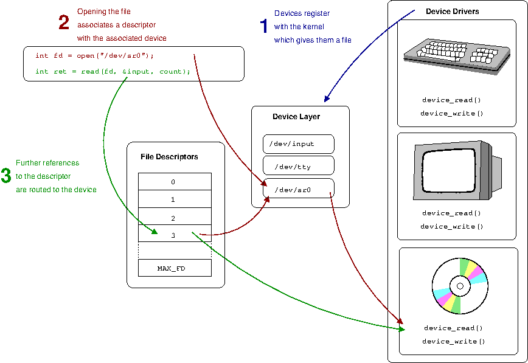
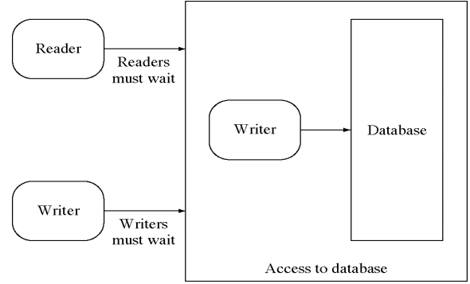

# Linux thinking

- [Linux thinking](#linux-thinking)
  - [1. Linux shell](#1-linux-shell)
    - [Processing Text](#processing-text)
      - [Count the number of lines satisfying a specific pattern in a log file](#count-the-number-of-lines-satisfying-a-specific-pattern-in-a-log-file)
      - [Calculate KLOC of code C/C++ files in a directory](#calculate-kloc-of-code-cc-files-in-a-directory)
    - [System](#system)
      - [Kill multiple processes following a patterns (using awk, grep, xargs)](#kill-multiple-processes-following-a-patterns-using-awk-grep-xargs)
      - [Kill processes opening a specific port (using netstat, grep...)](#kill-processes-opening-a-specific-port-using-netstat-grep)
      - [Find files via regular expressions, and remove them](#find-files-via-regular-expressions-and-remove-them)
      - [List, one at a time, all files larger than 100K in the /home/username directory tree. Give the user the option to delete or compress the file, then proceed to show the next one. Write to a logfile the names of all deleted files and the deletion times](#list-one-at-a-time-all-files-larger-than-100k-in-the-homeusername-directory-tree-give-the-user-the-option-to-delete-or-compress-the-file-then-proceed-to-show-the-next-one-write-to-a-logfile-the-names-of-all-deleted-files-and-the-deletion-times)
    - [Shell Scripting](#shell-scripting)
  - [Linux System Programming](#linux-system-programming)
    - [File và File System](#file-v%C3%A0-file-system)
      - [File descriptor là gì?](#file-descriptor-l%C3%A0-g%C3%AC)
      - [Dạng tập tin](#d%E1%BA%A1ng-t%E1%BA%ADp-tin)
        - [Regular file](#regular-file)
        - [Special file](#special-file)
          - [Các tập tin thiết bị](#c%C3%A1c-t%E1%BA%ADp-tin-thi%E1%BA%BFt-b%E1%BB%8B)
          - [Các ống có tên (pipes)](#c%C3%A1c-%E1%BB%91ng-c%C3%B3-t%C3%AAn-pipes)
          - [Các socket](#c%C3%A1c-socket)
          - [Liên kết mềm](#li%C3%AAn-k%E1%BA%BFt-m%E1%BB%81m)
          - [Stdin, stdout and Stderr](#stdin-stdout-and-stderr)
    - [Process & Thread](#process--thread)
      - [Process](#process)
        - [Processes là gì?](#processes-l%C3%A0-g%C3%AC)
        - [Memory Layout](#memory-layout)
      - [Thread](#thread)
        - [Thread là gì?](#thread-l%C3%A0-g%C3%AC)
        - [POSIX Thread](#posix-thread)
        - [API POSIX Thread](#api-posix-thread)
          - [Tạo Thread mới](#t%E1%BA%A1o-thread-m%E1%BB%9Bi)
          - [Kết thúc thread](#k%E1%BA%BFt-th%C3%BAc-thread)
          - [Joinable Thread](#joinable-thread)
        - [Multithreading](#multithreading)
        - [Race Condition](#race-condition)
          - [Ngăn chặn race condition](#ng%C4%83n-ch%E1%BA%B7n-race-condition)
        - [Deadlock](#deadlock)
          - [Cách ngăn chặn Deadlock](#c%C3%A1ch-ng%C4%83n-ch%E1%BA%B7n-deadlock)
      - [Synchronization](#synchronization)
        - [Semaphore](#semaphore)
        - [Mutex và Semaphore](#mutex-v%C3%A0-semaphore)
        - [Reader Writer Problem](#reader-writer-problem)
          - [Phát biểu bài toán Reader Writer Problem](#ph%C3%A1t-bi%E1%BB%83u-b%C3%A0i-to%C3%A1n-reader-writer-problem)
          - [Giải quyết Reader Writer Problem](#gi%E1%BA%A3i-quy%E1%BA%BFt-reader-writer-problem)
      - [Networking](#networking)
        - [Sử dụng socket TCP, UDP](#s%E1%BB%AD-d%E1%BB%A5ng-socket-tcp-udp)
          - [Server](#server)
          - [Client](#client)
        - [Phân biệt Nonblocking I/O và Blocking I/O](#ph%C3%A2n-bi%E1%BB%87t-nonblocking-io-v%C3%A0-blocking-io)
    - [Thực hành Linux System Programming](#th%E1%BB%B1c-h%C3%A0nh-linux-system-programming)
      - [Tool](#tool)
  - [Reference](#reference)

## 1. Linux shell

### Processing Text

#### Count the number of lines satisfying a specific pattern in a log file

Dùng `grep` để tìm chuỗi pattern chỉ định trong một file, thêm `-c` để đếm số dòng có pattern được nhập. Câu lệnh bên dưới là tìm `error` trong `error.log`

```bash
grep -c 'error' error.log
```

#### Calculate KLOC of code C/C++ files in a directory

Dùng lệnh `find` với regex để tìm các files c/c++ trong thư mục hiện hành. Sau đó dùng lệnh cat để in ra các dòng, kết hợp với `wc -l` để đếm số dòng được cat in ra.

```bash
echo $(($(cat $(find . -regextype posix-extended -regex '.*?\.(c(pp)?)$') | wc -l )/1000.0))
```

### System

#### Kill multiple processes following a patterns (using awk, grep, xargs)

```bash
kill $(ps -ef | awk '$NF ~ /chrome/ {print $2;}')
```

Khi dùng lệnh `ps -ef` sẽ có kết quả:

```bash
cpu11413  7946  2924  0 13:43 tty2     00:00:01 /opt/google/chrome/chrome --type=zygote --enable-crash-repor
cpu11413  7958  2924  0 13:43 tty2     00:00:01 /opt/google/chrome/chrome --type=zygote --enable-crash-repor
cpu11413  7986  2924  0 13:45 tty2     00:00:00 /opt/google/chrome/chrome --type=zygote --enable-crash-repor
cpu11413  8021  2924  0 13:45 tty2     00:00:04 /opt/google/chrome/chrome --type=zygote --enable-crash-repor
cpu11413  8267  2924  1 13:49 tty2     00:00:55 /opt/google/chrome/chrome --type=zygote --enable-crash-repor
root      9491     2  0 14:03 ?        00:00:00 [kworker/1:1]
cpu11413  9494  2924  0 14:03 tty2     00:00:05 /opt/google/chrome/chrome --type=zygote --enable-crash-repor
cpu11413  9507  2924  0 14:03 tty2     00:00:00 /opt/google/chrome/chrome --type=zygote --enable-crash-repor
cpu11413  9521  2924  0 14:03 tty2     00:00:00 /opt/google/chrome/chrome --type=zygote --enable-crash-repor
cpu11413  9547  2924  0 14:03 tty2     00:00:00 /opt/google/chrome/chrome --type=zygote #--enable-crash-repor
cpu11413  9557  2924 # 1 14:03 tty2     00:00:27 /opt/google/chrome/chrome --type=zygote #--enable-crash-repor
```

Có thể thấy `PID` là nằm ở cột 2 và, tên process nằm ở cột cuối cùng. Dùng lệnh `awk` để tìm ra dòng nào có cột cuối cùng có chứ tên process và in ra cột 2 (PID)

#### Kill processes opening a specific port (using netstat, grep...)

```bash
sudo kill $(sudo netstat -plnt | awk '/8080/{print substr($NF, 1, index($NF, "/") - 1);}')
```

Khi dùng lệnh `sudo netstat -plnt` sẽ được kết quả

```bash
Active Internet connections (only servers)
Proto Recv-Q Send-Q Local Address           Foreign Address         State       PID/Program name
tcp        0      0 127.0.0.1:16392         0.0.0.0:*               LISTEN      11723/code
tcp        0      0 0.0.0.0:8080            0.0.0.0:*               LISTEN      13196/python3
tcp        0      0 0.0.0.0:80              0.0.0.0:*               LISTEN      1427/nginx: master  
tcp        0      0 127.0.0.53:53           0.0.0.0:*               LISTEN      718/systemd-resolve
tcp        0      0 127.0.0.1:631           0.0.0.0:*               LISTEN      967/cupsd
tcp        0      0 127.0.0.1:5432          0.0.0.0:*               LISTEN      1504/postgres
tcp6       0      0 :::45361                :::*                    LISTEN      11723/code
tcp6       0      0 ::1:631                 :::*                    LISTEN      967/cupsd
```

Sẽ thấy `PID/Program name`, nên cần tách `PID` ra, dùng `substr` để cắt chuỗi, và `index` dùng để tìm ra vị trí của `/`.

#### Find files via regular expressions, and remove them

`regex` bên dưới dùng để tìm các file `*.c` và `*.cpp` trong thư mục hiện hành.

```bash
rm -rf $(find . -regextype posix-extended -regex '.*?\.(c(pp)?)$')
```

#### List, one at a time, all files larger than 100K in the /home/username directory tree. Give the user the option to delete or compress the file, then proceed to show the next one. Write to a logfile the names of all deleted files and the deletion times

```bash
##!/bin/bash
read -p  "Enter pattern: " pattern
read -p "Enter option: " opt
files=$(sudo find ~ -name $pattern -type f -size +100k)
if [ "$opt" = "compress" ]; then
        sudo zip 'test.zip' $files >> 'test-compress.log'
elif [ "$opt" = "delete" ]; then
        sudo rm -v $files > 'test-delete.log'
else
        echo "Not found option: $opt"
fi
```

Script đầu tiên sẽ chạy lệnh:

```bash
sudo find ~ -name $pattern -type f -size +100k
```

Để tìm kiếm các file lớn hơn 100KB có trong cây thư mục `/home/username`. Tiếp theo là sẽ kiểm tra điền kiện `opt` để thực hiện lệnh tương ứng.

Chạy file [100kfile.sh](linux-shell/100kfile.sh)

Khi chạy file cần nhập pattern của các file muốn tìm kiếm, và 1 trong 2 option là `compress` và `delete`. Sau đó script sẽ được chạy:

- **compress** thì sẽ có 2 file `test.zip` và `test-compress.log`
- **delete** thì sẽ có file log là `test-delete.log`

### Shell Scripting

```bash
awk '{s+=$1} END {print s}' sample.data
```

Dùng awk để cộng dồn là cách nhanh nhất.

Có thể sử dụng shell script, thì sẽ chậm hơn rất nhiều.

```bash
##!/bin/bash
sum=0
while IFS= read -r var
do
        sum=$(expr $var + $sum)
done < $1
echo "$sum"
```

Dòng while sẽ đọc từng dòng trong file dữ liệu, và cộng dồn vào biến `$sum`.

## Linux System Programming

### File và File System

#### File descriptor là gì?

Một **file discription** là số định duy nhất một tệp đang mở trong hệ điều hành. Nó mô tả một tài nguyên dữ liệu và cách tài nguyên đó có thể truy cập được.

Discriptor được định danh bởi một số nguyên không âm duy nhất.



#### Dạng tập tin

##### Regular file

Một **regular file** là một loại tệp có thể được lưu trữ trong hệ thống tệp. Hầu hết files được sử dùng trực tiếp bởi người dùng là các tệp thông thường. Ví dụ: tệp thực thi, tệp văn bản, tệp hình ảnh cũng là tệp thường.

##### Special file

Đối với hệ điều hành thì tập tin chỉ là một chuỗi các type liên tục. Nhờ vậy có thể dùng khái niệm tập tin cho các thiết bị và các đối tượng khác. Điều này đơn giản hóa sự tổ chức và trao đổi các dữ liệu, vì có thể thực hiện ghi dữ liệu vào tập tin, chuyển đữ liệu trên các thiết bị và trao đổi đữ liệu giữa các tiến trình tương tụ nhau. Những thành phần cũng được Linux coi là tập tin.

- Các tập tin thiết bị
- Các ông (kênh) có tên (named pipe)
- Các socket
- Các liên kết mềm (symlinks)

###### Các tập tin thiết bị

Đối với Linux thì tất cả các thiết bị kết nối với máy tính (ổ cứng, ổ tháo rời, terminal, máy in, máy scan, bàn phím, chuột, v.v...) đề là các tập tin. Ví dụ, nếu cần đưa ra màn hình terminal thứ nhất thông tin nào đó, thì hệ thống thực hiện thao tác ghi vào tập tin `/dev/tty1`.

Có hai dạng thiết bị: __ký tự__ (hay còn gọi là các thiết bị trao đổi byte) và **khối** (trao đổi theo khối). Sự khác nhau giữa hai dạng này nằm ở cách đọc và ghi thông tin vào các thiết bị. Các thiết bị ký tự trao đổi thông tin theo từng ký tự trong chế độ chuỗi các byte. Ví dụ thiết bị dạng này là terminal. Còn thông tin được đọc và ghi vào các thiết bị khối theo các khối. ví dụ các ổ cứng. Không thể độc từ đĩa cứng và ghi lên đó từng byte, trao đổi thông tin với đĩa chỉ có thể theo từng khối.

Mỗi dạng thiết bị có thể có một vài tập tin thiết bị. Vì thế các tập tin thiết bị thường có hai số: lớn (major) và nhỏ (minor). Số lớn của thiết bị cho kernel biết là tập tin này thuộc về driver nào, còn số nhỏ cho biết cần phải làm việc với thiết bị cụ thể nào của dạng này. Đối với các tập tin thiết bị, câu lệnh `ls -l` cho biết số lớn và số nhỏ đã nói thay vì kích thước của tập tin.

```bash
crw-rw-rw-  1 root     tty       5,   0 Thg 5 13 08:38 tty
crw--w----  1 root     tty       4,   0 Thg 5 13 08:38 tty0
crw--w----  1 gdm      tty       4,   1 Thg 5 13 08:38 tty1
crw--w----  1 root     tty       4,  10 Thg 5 13 08:38 tty10
crw--w----  1 root     tty       4,  11 Thg 5 13 08:38 tty11
```

Có thể thấy được số nhỏ và số lớn ở cột 4 và cột 5.

###### Các ống có tên (pipes)

Các ống có tên, hay bộ đệm FIFO (**F**irst **I**n - **F**irst **O**ut). Tập tin dạng này chủ yếu dùng để tổ chức trao đổi dữ liệu giữa các chương trình khác nhau.

Pipe là cách rất hữu dụng để trao đổi thông tin giữa các tiến trình. Một tiến trình có thể đọc tất cả những gì mà một tiến trình khác đặt vào ống. Nếu có hai tiến trình được sinh ra từ một tiến trình mẹ trao đổi thông tin, thì ống có thể không có tên. Trong trường hợp ngược lại cần tạo ra một ống có tên, ví dụ bằng chương tình mkfifo. Khi này bản thân tập tin pipe chỉ tham gia vào sự khởi đầu trao đổi dữ liệu.

###### Các socket

Socket đó là kết nối giữa các tiến trình, cho phép chúng giao tiếp mà không chịu ảnh hưởng của các tiến tình khác. Socket là khái niệm then chốt của TCP/IP và như vậy là dựa trên socket đã xây dựng toàn bộ Internet. Từ phía hệ thống tập tin socket thực tế không khác các pipe: đó chỉ là các điểm cho phép nối các chương trình với nhau. Sau khi tạo ra kết nối, thì trao đổi được thực hiện mà không cần đến socket: dữ liệu do kernel chuyển trực tiếp từ chương trình này đến chương trình khác.

Mặc dù những tiến trình khác có thể thấy các tập tin socket, nhưng những tiến trình không tham gia vào kết nối hiện thời không thể thực hiện bất kỳ thao tác đọc hay ghi nào lên tập tin socket.

###### Liên kết mềm

Trong Linux, có dạng liên kết là liên kết cứng. Liên kết cứng chỉ là một tên khác cho tập tin ban đầu. Nó được ghi trong mô tả inode của tập tin đó. Sau khi tạo liên kết cứng khong thể phân biệt đâu là tên tập tin còn đâu là liên kết. Nếu đọc xóa một trong só những tập tin này, thì tập tin vẫn được lưu trên đĩa cho đến khi còn ít nhất một liên kết cứng. Điểm đặc biệt của liên kết cứng là nó chỉ thẳng đến chỉ số inode, và do đó liên kết cứng chỉ có thể đùng cho tập tin của một hệ thống tập tin, tức là trên cùng một phân vùng.

Nhưng trên Linux có một dạng liên kết khác gọi là (liên kết tượng trưng). Những liên kết này cũng có thể coi là tên phục cho tập tin, nhưng chúng là những tập tin khác - những tập tin liên kết mềm. Khác với liên kết cứng, liên kết mềm có thể chỉ đến những tập tin nằm trong hệ thống tập tin khác, ví dụ trên những đĩa lưu động, hoặc thậm chí trên một máy tính khác. Nếu tập tin đầu bị xóa thì liên kết này trở nên vô giá trị.

###### Stdin, stdout and Stderr

|Tên |File discriptor   |Mô tả   |
|---|---|---|
|Standard input (stdin)  |0   |Luồng dữ liệu mặc định cho đầu vào, ví dụ trong một command pipelin. Trong terminal, mặc định bàn phím là đầu vào từ user   |
|Standard output (stdout)  |1   |Luồng dữ liệu mặc định cho đầu ra, ví dụ khi một lệnh in ra đoạn text. Trong terminal, mặc định là màn hình của user   |
|Standard error (stderr)   |2   |Luồng dữ liệu mặc định cho đầu ra có xảy ra lỗi. Trong terminal, mặc định là màn hình của user   |

### Process & Thread

#### Process

##### Processes là gì?

Processes là một object code trong thực thi: hoạt động, chạy chương trình. Nhưng nó không đơn thuần là một object code, processes bao gồm dữ liệu, tài nguyên, trạng thái, và máy ảo.

Processes bắt đầu vòng đời như một executable object code, là mã máy trong một định dạng thực thi mà kernel có thể hiểu được. Format chung hầu hết trong Linux được gọi là Executable and Linkable Format (ELF). Định dạng thực thi bao gồm metdata, nhiều sections code và dữ liệu.

Sections quan trọng và phổ biến nhất là text section, data section và bss section (block started by symbol). Text section chứa code thực thi và dữ liệu chỉ đọc, như hằng số. Data section chứa dữ liệu khởi tạo, section này có thể đọc và ghi. Bss section chưa dữ liệu global chưa khởi tạo. Các biến C chưa được khởi tạo về cơ bản là tất cả số 0, nên không cần lưu trữ số không trong object code trên đĩa.

Một process được liên kết với các tài nguyên hệ thống khác nhau, được phân xử và quản lý bởi kernel. Các process thường yêu cầu và thao tác với tài nguyên thông qua system calls. Tài nguyên bao gồm timers, pending signals, open files, network connections, hardware, và IPC machinsms.

Mỗi process có một ID (PID), đó là một số nguyên dương, dùng để định danh duy nhất tiến trình đó trong hệ thống. PID được sử dụng trong rất nhiều các system call.

##### Memory Layout

- **Text segment:** Bao gồm lệnh ngôn ngữ máy của chương trình mà process chạy. Phân vùng này là read-only để không bị vô tình thay đổi bằng con trỏ khi lập trình. Do nhiều process có thể chạy cùng một chương trình, phân vùng này có thể chia sẻ để chỉ cần một bản copy code chương trình có thể được map tới không gian địa chỉ ảo của nhiều process khác nhau.
- **Initialzed data segment:** gồm các biến toàn cục và biến tĩnh được khai báo tường minh. Những giá trị nãy được đọc từ file thực thi khi chương trình dược load vào RAM.
- **Unitialized data segment:** gồm những biến toàn cục và biến tĩnh không được khai báo tường minh. Trước khi chạu chương trình thì hệ thống sẽ đặt toàn bộ vùng nhớ này về giá trị 0.
- **Stack:** là phân vùng tự dộng tăng kích thước. Phân vùng này bao gồm các stack frame. Mỗi stack frame được cấp phát cho mỗi function được gọi, và nó lưu trữ những biến cục bộ của function, các argument và giá trị trả về.
- **Heap:** là vùng nhớ dùng cho việc cấp phát động ở runtime.


#### Thread

##### Thread là gì?

Mỗi process bao gồm một hoặc nhiều thread. Một thread là một đơn vị hoạt động bên trong process. Nói cách khác, một thread là sự trựu tượng chịu trách nhiệm thực thi code và duy trạng thái running của process.

Hầu hết các process chỉ bao gồm một thread, chúng được gọi là single-threaded. Process chứa nhiều thread, được gọi là multithreaded.

Một thread bao gồm một stack (lưu các biến cục bộ của nó), trạng thái processor, và vị trí hiện tại trong object code. Hầu hết các phần còn lại của process được chia sẻ giữa tất cả các thread, đáng chú ý nhất là không gian địa chỉ process. Bằng cách này, các thread chia sẻ các bộ nhớ ảo trừu tượng trong khi duy trì processor ảo trừu tượng.

Các trạng thái của thread:

- **New thread:** khi một thread mới được tạo, nó là new state. Khi một thread ở trạng thái này, thì thread vẫn chưa hoạt động.
- **Runnable:** một thread đã sẵn sàng để chạy, nó sẽ chuyển sang trạng thái runnable. Trong trạng thái này, một thread có thể thực sự đang chạy hoặc có thể sẵn sàng chạy bất cứ lúc nào.
- **Blocked/Waiting:** khi một thread tạm thời không hoạt động, sau đó nó có thể nằm trong một những trạng thái sau:
  - Blocked
  - Waiting

##### POSIX Thread

Trước đây, các nhà cung cấp phần cứng triển khai thread và cung cấp các APT để lập trình thread của riêng mình. Điều này gây khó khăn cho các developer khi phải học nhiều phiên bản thread và viết một chương trình thread chạy đa nền tảng phần cứng. Trước nhu cầu xây dựng interface lập trình thread chung, tiêu chuẩn POSIX Thread (pthread) cung cáp các interface lập trình thread trên ngôn ngữ C/C++ đã ra đời.

##### API POSIX Thread

###### Tạo Thread mới

```cpp
#include <pthread.h>

int pthread_create(pthread_t *thread, const pthread_attr_t *attr, void *(*start)(void *), void *arg);

```

Hàm **pthread_create()** tạo ra một thread mới trong tiến trình, entry point của thread mới này là hàm **start()** với đối số là **arg (start(arg))**. Main thread của tiến trình tiếp tục thực thi với các lệnh sau hàm pthread_create() đó.

###### Kết thúc thread

```cpp
#include <pthread.h>

void pthread_exit(void *retval);
```

Việc gọi hàm **pthread_exit()** có tác dụng giống với việc gọi return của hàm bắt đầu của thread đó. Nhưng hàm pthread_exit() không return giá trị nào cho hàm gọi nó.

###### Joinable Thread

```cpp
#include <pthread.h>

int pthread_join(pthread_t thread, void **retval);
```

Hàm **pthread_join()** sẽ block chương trình và chờ cho thread với ID thread. Việc gọi hàm pthread_join() 2 lần với cùng một thread ID có thể dẫn đến lỗi `unpredictable behavior`

##### Multithreading

Trong các hệ thống đa lõi và đã xử lý thì đa luồng tức là các thread được thực hiện cùng lúc trên lõi hoặc bộ vị xử lý khác nhau.

Trong các hệ thống lõi đơn thì đa luồng chia thời gian giữu các thread. System sẽ gửi 1 số lượng nhất định các hướng dẫn từ mỗi Thread để xử lý. Các Thread không được thực hiện đồng thời. System chỉ mô phỏng thực hiện đồng thời của chúng. Tsinh năng này của System được gọi là đa luồng.

##### Race Condition

Race Condition là trường hợp xảy ra trong critical section. Khi có hai hay nhiều Thread cùng chia sẻ dữ liệu, hay đơn giản là cùng đọc và ghi vào một vùng dữ liệu. Khi đó vấn đề xảy ra là: Kết quả của việc thực multiple thread có thể thay đổi phụ thuộc vào thứ tự thực thi các thread.

###### Ngăn chặn race condition

Để ngăn chặn `Race condition`:

- Semphore
- Mutex

```cpp
x++
```

Khi chạy multiple thread thì scenario mong đợi là:

x = 5

|Time|Thread 1|Thread 2|
|---|---|---|
|1|load x into register (5)||
|2|add 1 to register (6)||
|3|store register in x (6)||
|4||load x into register (6)
|5||add 1 to register (7)|
|6||store register in x (7)

Nhưng khi xảy ra race condition thì kết quả sẽ có thể không được như mong đợi:  

|Time|Thread 1|Thread 2|
|---|---|---|
|1|load x into register (5)||
|2|add 1 to register (6)|load x into register (5)|
|3|store register in x (6)|add 1 to register (6)|
|4||store register in x (6)

##### Deadlock

Deadlock là tình huống mà trong đó hai threads cùng đang chờ cho thread kia kết thúc. Cả hai luồng đều chờ đợi nhau giải phóng tài nguyên

Deadlock xảy ra với bốn điều kiện sau xảy ra đồng thời:

- Ngăn chặn (loại trừ) lẫn nhau: vì chỉ có 1 process được ở trong critical section
- Gữi và đợi (Hold and wait)
- Không có ưu tiên (độc quyền): process thực hiện mãi mà không dừng để giải phóng tài nguyên cho process khác
- Chờ đợi vòng tròn (Cricular wait)

```java
public class Main {
    public static void main(String[] args) {
        final String resource1 = "Phuc dep trai";
        final String resource2 = "Tran Trong Phuc";

        //t1 lock resource1 sau đó resource2
        Thread t1 = new Thread() {
            public void run() {
                synchronized (resource1) {
                    System.out.println("Thread 1: locked resource 1");

                    try {
                        Thread.sleep(100);
                    } catch (Exception e) {
                    }

                    synchronized (resource2) {
                        System.out.println("Thread 1: locked resource 2");
                    }
                }
            }
        };

        // t2 lock resoucre2 sau đó resource1
        Thread t2 = new Thread() {
            public void run() {
                synchronized (resource2) {
                    System.out.println("Thread 2: locked resource 2");

                    try {
                        Thread.sleep(100);
                    } catch (Exception e) {
                    }

                    synchronized (resource1) {
                        System.out.println("Thread 2: locked resource 1");
                    }
                }
            }
        };

        t1.start();
        t2.start();
    }
}
```

Output:

```java
Thread 1: locked resource 1
Thread 2: locked resource 2
```

Thread 1 đang lock, và sau đó Thread 2 cũng lock, khi quay lại Thread 1 thì resource2 đang bị lock phải chờ, ngược lại thread 2 cũng vậy, dẫn đến thread đang chờ nhau rơi vào deadlock

###### Cách ngăn chặn Deadlock

Để ngăn chặn Deadlock là bảo đảm ít nhất một rong bốn điều kiện không thể xuất hiện

**Ngăn cản lẫn nhau:** đảm bảo là hệ thống không có các file không thể chia sẻ . Một process không bao giờ phải chờ tài nguyên có thể chia sẻ.

**Giữ và đợi cấp thêm tài nguyên:** phải đảm bảo rằng mỗi khi một process yêu cầu một tài nguyên, nó không giữ bất kỳ tài nguyên nào khác.

**Không có ưu tiên:**  không đòi lại tài nguyên từ process đang giữ chúng. Nếu một process đang giữ một số tài nguyên và yêu cầu tài nguyên khác mà không thể được phân phối ngay cho nó thì tất cả các tài nguyên nó đang giữ được giải phóng. Các tài nguyên ưu tiên được thêm vào danh sach tài nguyên dành cho tiến trình đang chờ đợi. Process sẽ khởi động lại chỉ khi nó có thể lấy lại các tài nguyên cũ của nó cũng như các tà nguyên mới mà nó đang yeu cầu.

**Chờ đợi vòng tròn:** áp dụng một thứ tự tuyết đối cho tất cả các loại tài nguyên. Mỗi loại được gắn một số nguyên. Mỗi process yêu cầu các tài nguyên theo thứ tự tăng dần - chỉ có thể nhận được tài nguyên có trọng số cao hơn của bất kỳ tài nguyên nào nó đang giữ. Muốn có tài nguyên j, process phải giải phóng tất cả các tài nguyên có trọng số i > j (nếu có).

#### Synchronization

##### Semaphore

Semaphore là một cấu trúc dữ liệu được định nghĩa để ngăn chặn `Race condition` trong quá trình chia sẻ tài nguyên của các tác vụ trong hoạt động của hệ thống.

Semaphore hỗ trợ hai operator chính:

- await(semaphore): giảm và khóa cho tới khi semaphore được mở.
- signal(semaphore): tăng và cho phép thêm một luồng mới được tham giam hoạt động.

Trong sychronization với semaphore có một hàng đợi gồm các tác vụ cần được thực thi sẽ có các tình huống hoạt động cơ bản như sau:

- Khi một thread wait()
  - Nếu semaphone được mở thì luồng đó sẽ được gia nhập và tiếp tục thực thi
  - Nếu semaphone đang bị đóng thì nhánh sẽ bị khóa và phải nằm chờ trong hàng đợi cho tới khi nào semaphore được mở signal()
- Khi một thread signal()
  - Nếu một thread đang nằm trong hàng đợi sẽ được đưa vào thực thi
  - Nếu không có thread nào trong hàng đợi thì signal sẽ được nhớ và dành cho thread tiếp theo.

##### Mutex và Semaphore

**Mutex** cho phép điều khiển hoạt động truy cập duy nhất vào critical section của hệ thống. Đảm phải loại trừ race condition trong hoạt động truy cập đồng thời của nhiều tác vụ, và chỉ có một tác vụ được thực thi tại mỗi thời điểm. Mutex được coi như là binary Semaphore

**Mutex** chỉ là một dạng semphore với `N=1`, Semaphore có phục vụ nhiều tác vụ, tài nguyên cùng lúc gọi là **Counting Semphore**.

##### Reader Writer Problem

###### Phát biểu bài toán Reader Writer Problem

Trong database cần có nhiều process cần đọc/ghi database. Làm sao cho việc đọc/ghi database của các process thỏa các điều kiện sau:

- Không tranh chấp nhau và không làm hỏng dữ liệu.
- Việc truy xuất database hiểu quả cao nhất.

###### Giải quyết Reader Writer Problem

Ở đây việc đọc database không hề ảnh hưởng đến dữ liệu database, có thể có đồng thời nhiều process/thread truy cập vào để đọc. Ghi database cần được thực hiện tuần tự để dữ liệu không bị hư. Nhưng khi có một process đang thực hiện ghi thì các process khác không được đọc.

 

Cho hai `mutex` để quản lý việc đọc/ghi trên database

- `mutex` dùng để quản lý việc truy xuất biến read count (rc)
- `db` dùng để quản lý việc ghi trong database

```java
Reader() {
  // Tăng rc (reader count)
  // quản lý có bao nhiêu người đọc database hiện tại
  wait(mutex);
  rc = rc + 1;
  signal(mutex);

  // Nếu đây là reader đầu tiên
  // thì sẽ kiểm tra xem hiện tại database có đang được ghi hay không?
  // Nếu không thì sẽ cho phép đọc database và khóa việc ghi. Đến khi nào rc = 0 thì ghi mới được mở khóa.
  // Nếu có thì lock hàm Reader hiện tại chờ cho database ghi xong
  if(rc==1)
    wait(db);
  readDB(Database);

  //Giảm rc (reader count)
  wait(mutex);
  rc = rc - 1;
  signal(mutex);

  //Nếu như không có ai đọc database thì mở khóa việc ghi
  if(rc==0)
    signal(db);
}

Writer()
{
  // Quản lý việc ghi
  // Tùy thuộc vào hiện tại có ai đang đọc database hay không.
  wait(db);
  writeDB(Database);
  signal(db);
}
```

#### Networking

##### Sử dụng socket TCP, UDP

###### Server

**Tạo socket:**

```c
int sockfd = socket(domain, type, protocol)
```

- **sockfd:** socket discriptor, là một số integer
- **domain:** integer, domain giao giếp, AF_INET (IPv4 Protocol), AF_INET6 (IPv6 Protocol)
- **type:** loại giao tiếp
  - SOCK_STREAM: TCP
  - SOCK_DGRAM: UDP
- **protocol:** Giá trị cho IP là 0

**Setsockopt:**

```c
int setsockopt(int sockfd, int level, int optname, const void * optval, socklen_t optlen);
```

Hàm này giúp chỉnh sửa các option cho socket thông qua file disciptor `sockfd`. Việc này hoàn toàn là tùy chọn, nhưng nó giúp sử dụng lại địa chỉ và cổng. Ngăn chặn lỗi như: `Địa chỉ này đã được sử dụng`

**Bind:**

```c
int bind(int sockfd, const struct sockaddr *addr, socklen_t addrlen);
```

Sua khi tạo socket, hàm bind sẽ bind socket đến địa chỉ và port đã được chỉnh định trong `addr`.

**Listen:**

```c
int listen(int sockfd, int backlog);
```

Nó đặt server socket vào chế độ bị động, nơi mà nó chờ client đến để kết nối với server. `backlog`, xác định độ dài tối đa mà hàng đợi của các kết nối đang chờ xử lý cho sockfd có thể tăng lên. Nếu yêu cầu kết nối đến khi hàng đợi đầy, client có thể nhận được lỗi `ECONREFUSED`

**Accept:**

```c
int new_socket = accept(int sockfd, struct sockaddr * addr, socklen_t *addrlen);
```

Hàm này sẽ lấy một yêu cầu kết nối từ hàng đợi, và tạo ra một kết nối socket mới, và trả về file descriptor mới chiếu đến socket đó. Lúc này đã thiết lập được kết nối giữa client và server có thể truyền được dữ liệu.

###### Client

**Kết nối socket:** Giống như tạo kết nối ở server

**Connect:**

```c
  int connect(int sockfd, const struct sockaddr *addr, socklen_t addrlen);
```

System call connect() kết nối socket thông qua file desciptor sockfd đến địa chỉ, port của server được chỉ định.

##### Phân biệt Nonblocking I/O và Blocking I/O

### Thực hành Linux System Programming

#### Tool

## Reference

- [Đọc file trong bash script](https://www.shellhacks.com/bash-read-file-line-by-line-while-read-line-loop/)
- [Lệnh grep](https://blogd.net/linux/lenh-grep-toan-tap/)
- [Lệnh xargs](https://blogd.net/linux/lam-quen-voi-xargs/)
- [Lệnh awk](https://blogd.net/linux/su-dung-lenh-awk/)
- [Shell script](https://www.shellscript.sh)
- [File discriptors (1)](https://www.bottomupcs.com/file_descriptors.xhtml)
- [File discriptors (2)](https://www.computerhope.com/jargon/f/file-descriptor.htm)
- [Regular file](https://www.computerhope.com/jargon/r/regular-file.htm)
- [Special file](https://www.computerhope.com/jargon/s/special-file.htm)
- [Process in Linux](https://kipalog.com/posts/Process-trong-Linux)
- [Deadlock](http://hedieuhanh.forumvi.com/t4498-topic)